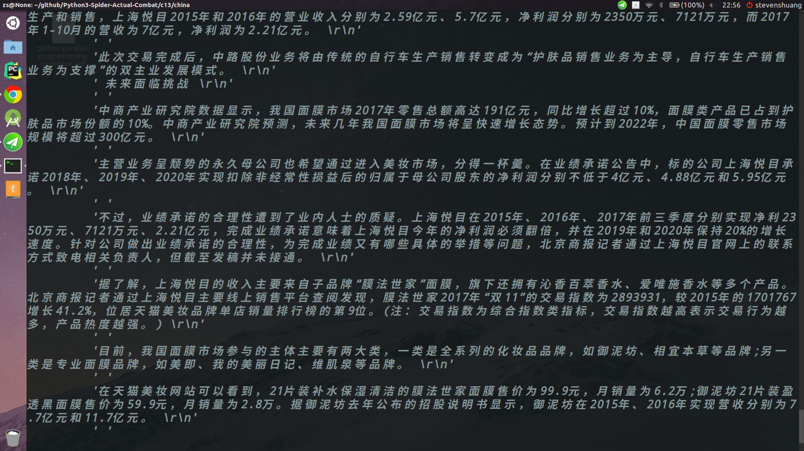

# 总结Scrapy通用爬虫的是使用

## 正常使用
* 继承ScrawlSpider, 
* 定义Item, 
* 定义ItemLoaders, 在ItemLoader中定义Input Processorr, 和Output Processor, 其中命名的方式 xx\_in, xx\_out

## 将配置文件外提
* 写为json文件
* 将Rule定义的规则外提
* 定义读取配置文件的方法
* 做启动函数

## Screenshot

