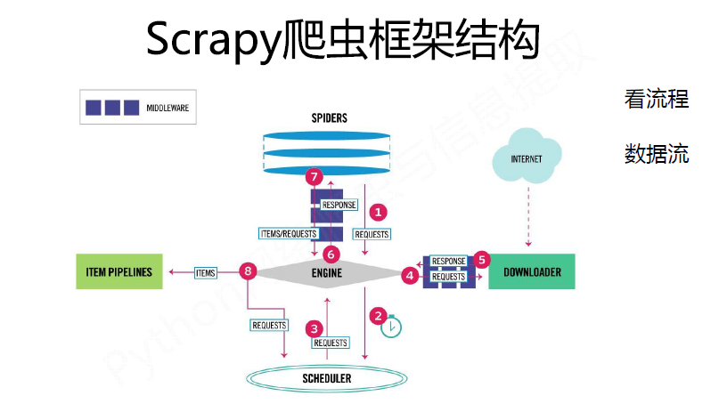

# Scrapy 框架的使用

## 安装
```bash
pipenv install scrapy
```

## 创建项目
```bash
scrapy startproject p_name
```

## 创建爬虫, 使用item, 以及pipeline
```python
scrapy genspider spider_name spider_url
修改 sipder_name的parser方法

在编写item类, 用来存储数据的, 需要使用scrapy.Field，类似django的感觉呢

pipeline多用来做数据清洗, 操作数据库
定义from_crawler()从配置文件导入配置
open_spier(), 在爬虫开启的时候，调用
close_spider() 关闭爬虫调用
process_item()  对结果item进行过滤
```

## Scrapy Xpath
```python3

from scrapy import Selector

selector = Selector(text=html)
result = selector.xpath('//a[@href="xx"]')

# 提取, 使用extract_first可以避免数组越界的问题, 还可以传默认参数, 得不到数据的时候返回
first_result = result.extract_frist()
results = result.extract()

```

## Spider使用
* 用start\_url初始化Request, 请求成功的时候, Response传递给回调函数进行处理
* 在回调函数中进行页面解析, 有两种情况, 解析出item数据, 另一个是解析到url, 重新加入调度队列
* 对解析出的item数据, 可以通过feed exports写入文件, 设置Pipeline写入数据库, 过滤等
* 返回的是Request，执行Request得到Response, 在用回调函数解析


## Spider的分析
### 重要基础属性
* alloww\_domains  允许的爬取域名
* stat\_urls 开始的url列表
* parse Response没有指定回调函数, 调用, 提取数据和下一步的请求, 返回一个Requerst, Item对象

## DOWNLOADER MIDDLERARES
> 想要重新定义DOWNLOADER MIDDLERARES 实现一下三个任意一个方法
* process\_request(request, spider)
    > Request被Scrapy的引擎调度给DownLoader前, 先调用该函数, 返回None, Request, Response
    > 返回None, 将有其他的DownLoader继续执行这个Request
    > 返回Request, Request重新放到调度队列中
    > 返回Response, 每个DOWNLOADER的 process_response()

* process\_response(request, response, spider)
    > 在下载Request后, 在Scrapy将Response传到spider处理之前, 通过process_request处理
    > 返回Request, 送入调度队列中，等待被处理
    > 返回Response 优先级较低的DOWNLOADER处理, 
    > 异常 调errorback()

* process\_exception()
    > 调用类似同上

## Spider MIDDLEWARES
> 四个方法
* process\_spider\_input(response, spider)
    > 返回None, 继续调用其他的Middleware
    > 异常 直接调用errback(), 为毛两次命名不一样, errorback(), errback()?????

* process\_spider\_output(response, result, spider)
    > 返回包含Request,或者item可迭代对象

* process\_spider\_exception(response, exception, spider)
    > 当input方法抛出异常的时候, 有该函数处理

## item pipeline
> 核心方法
* open\_spider()
* close\_spider()
* from\_crawler(cls, crawler)
    > 是一个类方法, 用@classmethod标识, 从配置文件中读取配置信息
* process\_item()
    > 处理Item对象, 如果出现异常, Item被丢弃

### 关于Images360项目的总结
> * 分析ajax, 得到一个普遍的请求
> * 在start\_requests()函数中开启分页爬取, 可以自己家标签, 在分标签爬取,
> * parse函数, 添加item数据
> * PipeLine 使用了MongoPipeLine, MysqlPipeLine, 来存储item的信息
> * 使用ImagePipeLine 来下载图片, 在设置中设置IMAGES\_STORE存储路径
> * 最后启动爬虫

## Scrapy 通用爬虫
1. CrawlSpider 继承scrapy.Spider, 主要的属性和方法
    > rules 包含多个Rule对象的list
    > parse_start_url 当start_url对应的Request得到Response该方法被调用
    ```python
    Rule(link_extractor, callback, cb_kwargs, follow, process_links, process_request)
    link_extractor在页面中提取那些链接, callback回调函数, cb_kwargs回调函数的参数
    follow提取的链接是否需要跟进, process_links 指定处理函数, 从link_extractors提取的链接调用该函数
    process_request 根据Rule的规则, 提取的Request, 该函数被调用
    ```
2. Item Loader
> Item Loader的API参数
> * Item 是item对象, 可以调用add\_xpath, add\_css, add\_value,
> * selector 是Selector对象, 用来提取填充的数据
> * response Response对象, 构造Response选择器

```python
from scrapy.loader import ItemLoader
from projects.items import Product

def parse(self, response):
    loaders = ItemLoader(item=Product(), response=response)
    loader.add_xpath('arrribute', '')
    loader.add_css('attribute','')
    loader.add_value('attribute', '')
    return loader.load_item()
```
## Processor 介绍
> ItemLoader的每个字段都包含了Input Processor, Output Processor, Input收到数据立刻提取, 但是不保存进item, load\_item调用的时候, 
> 会调用Output Processor, 处理收集到的数据, 然后保存进Item对象

* Identity
> 最简单的Processor, 不做任何处理, 直接返回原来的数据
* TakeList
> 常用做Output Porcessor, 提取地一个非空的值, 
* Join
> 链接字符串, 
* Compose 
> 有多个函数组成的processor, 每个输入值传给地一个参数, 返回值传给第二个参数, 类推
```python3
processor = Compose(str.upper, lambda x:x.strip())
print (processor(' hello world '))
```
* MapCompose
> 类似Compose, 迭代处理列比哦啊的输入值
processos = MapCompose(str.upper, lambda x:x.strip())
print (processor([' hello ', ' world']))

* SelectJmes
> 查询json, 传入key, 得到value, 先安装jmespath ```bashpipenv install jmespath```

## Scrapy框架结构


